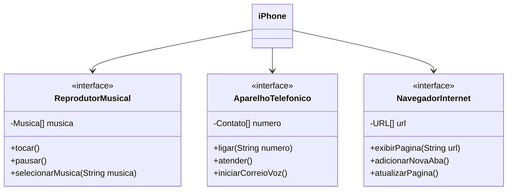

## POO - Desafio - Modelagem e Diagramação de um Componente iPhone

### Objetivo
Modelar e diagramar a representação UML do componente iPhone, abrangendo suas funcionalidades como Reprodutor Musical, Aparelho Telefônico e Navegador na Internet:
1. Criar um diagrama UML que represente as funcionalidades de um Iphone descritas acima.
3. Implementar as classes e interfaces correspondentes em Java.

#### Funcionalidades a Modelar
1. **Reprodutor Musical**
   - Métodos: `tocar()`, `pausar()`, `selecionarMusica(String musica)`
2. **Aparelho Telefônico**
   - Métodos: `ligar(String numero)`, `atender()`, `iniciarCorreioVoz()`
3. **Navegador na Internet**
   - Métodos: `exibirPagina(String url)`, `adicionarNovaAba()`, `atualizarPagina()`

### Diagrama UML (Mermaid)

